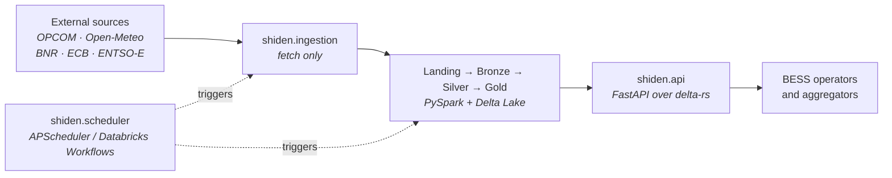

# Shiden Architecture

## Overview

Shiden is an energy market data API targeting **BESS (Battery Energy Storage System) operators and aggregators**. It collects, processes, and serves energy price signals, weather data, and derived intelligence (arbitrage windows, charge/discharge signals, price forecasts) to help operators decide when to charge and discharge storage assets.

**Initial market:** Romania. **Architecture is multi-market from day one** — adding a new market is config-only with zero code changes.



Full lineage, star schema, request path and deployment diagrams:
[System diagrams](diagrams.md).

---

## Tech Stack

| Layer | Choice | Notes |
|---|---|---|
| Processing engine | PySpark 3.5 | Local mode for dev; Databricks cluster in prod |
| Storage format | Delta Lake (`delta-spark 3.1`) | Native on Databricks; works locally |
| Architecture pattern | Medallion (Landing → Bronze → Silver → Gold) | See below |
| API | FastAPI + Uvicorn | Auto-generated OpenAPI docs at `/docs` |
| Scheduling (local) | APScheduler — `python -m shiden.scheduler.runner` | No external orchestrator for MVP |
| Scheduling (prod) | Databricks Workflows | Zero migration cost — same job functions |
| ML / Forecasting | scikit-learn (MVP) | Migrate to MLflow + MLlib on Databricks in V2 |
| Dev environment | VSCode dev containers | Python 3.11 + Java 11 + Spark |
| Source control | GitHub (private) | |
| Production target | Azure Databricks | |

---

## Deployment Environments

```
Local (dev / market validation)          Azure Databricks (production)
────────────────────────────────         ────────────────────────────
Dev container (Python + Java)            Databricks cluster
Delta Lake → ./data/delta/               Delta Lake → ADLS Gen2
APScheduler (embedded in app)            Databricks Workflows
SparkSession local[*]                    SparkSession (getOrCreate → cluster)
Manual/script backfill                   Auto Loader for landing → Bronze
```

Environment is controlled by the `ENVIRONMENT` setting (`local` | `databricks`).
`get_spark()` in `src/shiden/processing/spark.py` returns the appropriate session.

---

## Data Architecture: Medallion

All data sources — market prices, weather, and exchange rates — flow through the same medallion pipeline. There is no separate dimension layer; exchange rates are reference data that happen to be built via Bronze → Silver like everything else.

```
External Sources
      │
      ▼
┌─────────────┐
│  Landing    │  Raw files on disk (CSV, JSON, XML) — one file per source/date/location.
│  Zone       │  Never modified after write. On Databricks, replaces with object storage + Auto Loader.
└──────┬──────┘
       │
       ▼
┌─────────────┐
│   Bronze    │  Raw data parsed into typed Delta tables.
│             │  Append-only with revision capture: unchanged re-ingests write
│             │  nothing; revised upstream values append new rows (Silver reads
│             │  the latest per key by ingested_at).
│             │  Minimal transformation — type casting only, no business logic.
│             │  Tables: opcom_pzu_prices, weather, bnr_fx_rates, ecb_fx_rates,
│             │  entsoe_generation, entsoe_load.
└──────┬──────┘
       │
       ▼
┌─────────────┐
│   Silver    │  Cleaned, standardised, enriched, joined (Kimball star schema).
│             │  exchange_rates: BNR + ECB Bronze unified, deduplicated, gaps
│             │    FORWARD_FILLED (14-day lookback seed), SYNTHETIC EUR=1.0
│             │    rows for EUR markets.
│             │  fact_price: 15-min OPCOM prices, price_local_mwh + fx_rate +
│             │    price_eur_mwh via exchange_rates join.
│             │  fact_generation / fact_load / fact_weather: hourly, local keys.
└──────┬──────┘
       │
       ▼
┌─────────────┐
│    Gold     │  BESS-specific derived signals.
│             │  Arbitrage windows, charge/discharge signals, price forecasts.
│             │  Direct input to the FastAPI serving layer.
└──────┬──────┘
       │
       ▼
┌─────────────┐
│   FastAPI   │  REST API consumed by BESS operators and aggregators.
│             │  Versioned endpoints under /v1/
└─────────────┘
```

---

## Data Sources

### OPCOM — Day-Ahead Market (PZU)
- **URL:** `https://www.opcom.ro/grafice-ip-raportPIP-si-volumTranzactionat/ro`
- **Data:** 96 × 15-min intervals per delivery day — price (Lei/MWh), buy/sell volumes (MW)
- **Coverage:** Romania only (OPCOM is the Romanian market operator)
- **Auth:** None (public data)
- **Ingester:** `src/shiden/ingestion/opcom.py` → `OpcomIngester`
- **Bronze table:** `bronze/opcom_pzu_prices` — partitioned by `market_id`, `delivery_date`
- **Published:** ~13:00 Romanian time for the following delivery day
- **Schedule:** Daily at 14:00 EET/EEST

### Open-Meteo — Weather
- **URL:** `https://archive-api.open-meteo.com/v1/archive` (historical) / `https://api.open-meteo.com/v1/forecast` (current + forecast)
- **Data:** Hourly — temperature, wind speed (10m + 100m), solar radiation, cloud cover
- **Locations:** 6 representative points across Romania (see Weather Locations below)
- **Auth:** None (free API, no key required)
- **Ingester:** `src/shiden/ingestion/weather.py` → `WeatherIngester`
- **Bronze table:** `bronze/weather` — partitioned by `market_id`, `location_name`; includes `data_type` column (`REALIZED` for past dates, `FORECAST` for today/future)
- **Schedule:** Daily at 06:00 EET/EEST — two windows: D-7→D-1 (REALIZED, archive endpoint) + D0→D+2 (FORECAST, forecast endpoint)
- **ML note:** Silver training uses `data_type = REALIZED`; price forecast inference uses `data_type = FORECAST`

### BNR — EUR/RON Exchange Rates
- **URL:** `https://www.bnr.ro/nbrfxrates.xml` (today) / `https://www.bnr.ro/files/xml/years/nbrfxrates{YYYY}.xml` (archive)
- **Data:** Daily official exchange rates published by the National Bank of Romania
- **Auth:** None
- **Ingester:** `src/shiden/ingestion/bnr.py` → `BnrIngester` ✅ Done
- **Bronze table:** `bronze/bnr_fx_rates` — `(date, foreign_currency, rate_ron, multiplier)`, partitioned by `foreign_currency`
- **Note:** BNR is the authoritative source for Romanian contracts. OPCOM itself uses BNR rates for EUR publications. BNR publishes on business days only — weekends and holidays are forward-filled in Silver.

### ECB — EUR Crosses (Future Markets)
- **URL:** `https://www.ecb.europa.eu/stats/eurofxref/eurofxref-hist.xml`
- **Data:** Daily EUR/GBP, EUR/USD and all other EUR crosses — full history in one file (~5 MB)
- **Auth:** None
- **Ingester:** `src/shiden/ingestion/ecb.py` → `EcbIngester` ✅ Done
- **Bronze table:** `bronze/ecb_fx_rates` — `(date, quote_currency, rate)`, partitioned by `quote_currency`
- **Use case:** When GB or other non-EUR markets are added, ECB provides the relevant EUR cross. ECB also publishes EUR/RON — used to cross-validate against BNR in Silver.

### ENTSO-E — Actual Generation and Load
- **URL:** `https://web-api.tp.entsoe.eu/api` via entsoe-py
- **Data:**
  - A75 Actual Generation per Production Type — hydro, wind, solar, nuclear, gas, coal (hourly)
  - A65 Actual Total Load (hourly)
- **Auth:** API key — `ENTSOE_API_KEY` in `.env`; register at transparency.entsoe.eu
- **Ingester:** `src/shiden/ingestion/entsoe.py` → `EntsoeIngester` ✅ Done
- **Bronze tables:**
  - `bronze/entsoe_generation` — long format: `(market_id, timestamp_utc, production_type, actual_mw)`, partitioned by `market_id`; MERGE on `(market_id, timestamp_utc, production_type)`
  - `bronze/entsoe_load` — `(market_id, timestamp_utc, actual_load_mw)`, partitioned by `market_id`; MERGE on `(market_id, timestamp_utc)`
- **MultiIndex note:** entsoe-py returns MultiIndex columns for production types with both Actual Aggregated and Actual Consumption sub-types (e.g. Hydro Pumped Storage). These are flattened to `"Type|SubType"` in the landing JSON and Bronze `production_type` field.
- **Schedule:** Daily at 08:00 EET/EEST — D-7 to D-1 window
- **Key production types for RO:** Hydro Run-of-river (~30% of generation, main price driver), Wind Onshore (Dobrogea corridor), Nuclear (Cernavodă, 1400 MW base load), Fossil Gas (peaking), Hydro Pumped Storage (direct BESS competitor)

---

## Silver: Exchange Rates — ✅ Implemented

BNR and ECB are two distinct raw sources with different XML formats, publication schedules, and coverage. `ExchangeRatesProcessor` (`src/shiden/processing/silver/exchange_rates.py`) reconciles them into a single unified table.

### `silver/exchange_rates`

| Column | Type | Description |
|---|---|---|
| `date` | DATE | Day the rate applies (every calendar day — gaps filled) |
| `base_currency` | STRING | e.g. `EUR` |
| `quote_currency` | STRING | e.g. `RON`, `GBP` |
| `rate` | DOUBLE | 1 base = rate quote (EUR/RON ≈ 5.0) |
| `source` | STRING | `BNR`, `ECB`, `SYNTHETIC`, `FORWARD_FILLED` |
| `processed_at` | TIMESTAMP | |

Partition by `(base_currency, quote_currency)`.
Natural key: `(date, base_currency, quote_currency)` — MERGE on re-run.

**Reconciliation rules:**
- For EUR/RON: prefer BNR over ECB (BNR is the authoritative Romanian rate); ECB fills dates BNR is missing
- Weekends / holidays: forward-fill from the last published rate, mark `source = FORWARD_FILLED`. The fill is seeded with a 14-day Bronze lookback *before* the processing window, so a rolling window that starts on a weekend still resolves (a window-local fill would silently null weekend EUR prices)
- EUR markets (e.g. Germany): materialise a `SYNTHETIC` row with `rate = 1.0` so all Silver price tables join uniformly without special-casing

**EUR conversion in `silver/fact_price`:**
```
price_eur_mwh = price_local_mwh / fx_rate
  fx_rate from silver/exchange_rates
    ON date = delivery_date
   AND base_currency = market.reporting_currency ('EUR')
   AND quote_currency = market.currency
```
The applied `fx_rate` is stored on the fact row for auditability.

---

## Market Registry

Markets are defined in `src/shiden/config/markets.py` as a config registry.
**Adding a new market requires no code changes** — only a new entry in `MARKETS`.

```python
MarketConfig(
    bidding_zone="...",          # ENTSO-E EIC code
    timezone="...",              # pytz/zoneinfo string
    currency="...",              # local currency (RON, GBP, EUR)
    name="...",                  # human-readable name (dim_market)
    reporting_currency="EUR",    # target conversion currency (always EUR for now)
    fx_source="BNR|ECB|SYNTHETIC",
    weather_locations=(...)
)
```

Planned markets: Romania (live), Germany (`10Y1001A1001A83F`), GB (`10YGB----------A`).

---

## Weather Locations — Romania

Six geographically distributed points covering all major generation and demand zones.
Weights guide Gold-layer national signal aggregation.

| Location | Lat | Lon | Wind | Solar | Demand | Rationale |
|---|---|---|---|---|---|---|
| Bucharest | 44.43 | 26.10 | 0.02 | 0.22 | 0.35 | Largest demand centre; Muntenia prosumer solar |
| Dobrogea | 44.18 | 28.65 | 0.70 | 0.18 | 0.08 | ~70% of RO installed wind; coastal solar farms |
| Oltenia | 44.32 | 23.80 | 0.02 | 0.17 | 0.15 | CE Oltenia coal; SW solar; Olt river hydro |
| Transylvania | 46.77 | 23.59 | 0.05 | 0.15 | 0.20 | Someș/Arieș hydro proxy; central/NW demand |
| Moldova | 47.16 | 27.59 | 0.11 | 0.15 | 0.12 | NE wind; growing prosumer solar |
| Banat | 45.75 | 21.21 | 0.10 | 0.13 | 0.10 | Banat wind farms; W industrial demand |

**Solar weights are approximately equal across all regions** — reflecting the reality that government-subsidised prosumer solar is now distributed nationwide, not concentrated in any single zone.

Weights are approximate and should be refined once ANRE/Transelectrica published capacity data is integrated.

---

## Silver Layer

Silver is modelled as a **Kimball star schema** — conformed dimensions shared across fact
tables, no snowflaking. Full schema reference: [docs/silver_schema.md](silver_schema.md).

### Dimensions

| Table | Grain | Key notes |
|---|---|---|
| `silver/dim_date` | 1 row/day | Calendar-only (holidays incl. Jan 6+7 from 2024); FX lives in exchange_rates |
| `silver/dim_datetime` | 1 row/interval × IANA timezone | Generated per date range; resolves an OPCOM interval number to a UTC instant and a clock label. Replaced the static 96-row `dim_time`, which could not represent a DST changeover day — see [Time model](time-model.md) |
| `silver/dim_market` | 1 row/market | Bidding zone, timezone, currency, name (all from config) |
| `silver/dim_production_type` | ~20 rows (semi-static) | ENTSO-E type → category flags; discovered types get stable surrogate IDs (never renumbered) |
| `silver/dim_location` | 1 row/weather point | Lat/lon + aggregation weights for national signal |
| `silver/exchange_rates` | 1 row/day × currency pair | Reconciled BNR/ECB/SYNTHETIC, forward-filled |

### Facts

| Table | Grain | Rows/year (RO) |
|---|---|---|
| `silver/fact_price` | 15-min × market | ~35K |
| `silver/fact_generation` | 1-hour × production_type × market | ~131K |
| `silver/fact_load` | 1-hour × market | ~8.7K |
| `silver/fact_weather` | 1-hour × location | ~52.6K |

### Key design decisions

**Market-agnostic price columns:** `fact_price` stores `price_local_mwh`, the applied `fx_rate` (from `silver/exchange_rates`) and the derived `price_eur_mwh`. The settlement currency itself lives in `dim_market` — no market-specific column names anywhere in Silver/Gold/API.

**15-min ↔ hourly cross-grain join:** `dim_datetime.is_hour_start` maps any price interval to its corresponding generation/load/weather row; facts join on the UTC instant (`timestamp_utc` / `hour_start_utc`), never on a local clock position. Gold handles this join; Silver does not pre-aggregate.

**Long-format generation stays long in Silver:** `fact_generation` is one row per (timestamp, production_type). Pivoting to wide format is a Gold-layer concern.

**FX gaps closed in Silver:** `silver/exchange_rates` forward-fills weekends/holidays (source = `FORWARD_FILLED`, 14-day lookback seed), so facts and Gold never need their own fill logic and weekend EUR prices are always computable.

---

## Gold Layer

Gold produces API-shaped tables from the Silver facts. `gold/bess_signals` reads `silver/fact_price` directly rather than `gold/price_hourly`, so signals keep the 15-minute granularity of OPCOM day-ahead settlement.

| Table | Description |
|---|---|
| `gold/price_hourly` | ✅ Hourly prices: `price_local_mwh`, applied `fx_rate`, `price_eur_mwh`, `is_peak` |
| `gold/generation_hourly` | ✅ Hourly generation mix, pivoted wide from long-format `silver/fact_generation` |
| `gold/bess_signals` | ✅ 15-min signal: -1 charge, 0 idle, +1 discharge, plus daily ranks and spread |
| `gold/arbitrage_windows` | ⬜ Not materialised — windows are contiguous signal runs, derived per request from `gold/bess_signals` |
| `gold/price_forecast` | ⬜ Planned — next-day forecast (scikit-learn, weather features → price) |

---

## API Layer

FastAPI app at `src/shiden/api/main.py`. All endpoints versioned under `/v1/`.

| Prefix | Description | Status |
|---|---|---|
| `/v1/prices/{market_id}` | Hourly prices from gold/price_hourly (local + EUR + fx_rate) | ✅ |
| `/v1/generation/{market_id}` | Hourly generation mix from gold/generation_hourly | ✅ |
| `/v1/weather/{market_id}` | Weather (Gold weather table) | 501 — planned |
| `/v1/bess/{market_id}/arbitrage-windows` | Charge/discharge windows from gold/bess_signals | ✅ |
| `/v1/bess/{market_id}/signals` | 15-min signals from gold/bess_signals | ✅ |
| `/v1/bess/{market_id}/forecast` | Price forecast (ML phase) | 501 — planned |

Unknown `market_id` → 404; inverted date ranges → 422. Handlers are sync
(`def`) so blocking delta-rs/pandas reads run in FastAPI's threadpool.

Auto-generated OpenAPI docs: `http://localhost:8000/docs`

---

## Key Design Decisions

### Exchange rates go through the full medallion
BNR and ECB are two distinct sources with different formats and schedules. The transformation to a unified, reconciled, gap-filled `silver/exchange_rates` table is real processing work — it belongs in Silver, not in a separate dimension layer. All Silver tables join `silver/exchange_rates` the same way they join any other Silver table.

### Landing zone pattern
Raw files are written to disk before any processing. If Bronze parsing fails or the schema changes, historical raw data can be re-processed without re-fetching from the source. On Databricks, the landing zone becomes object storage (ADLS Gen2) and Auto Loader replaces the manual file iteration.

### Bronze is append-only, with revision capture
Bronze is an immutable record of what arrived and when — rows are never updated in-place. All writers use `delta_io.append_new_observations`: a re-ingested row whose values are unchanged is skipped (growth guard for the rolling ingest windows); a revised upstream value (ENTSO-E republishes corrected actuals; forecasts update every model run) is appended as a NEW row, preserving the full observation history. Silver recovers current state with `delta_io.deduplicate_latest` (newest `ingested_at` per natural key). Observation keys include everything that distinguishes an observation — e.g. weather keys include `data_type`, so a REALIZED ingest is never blocked by earlier FORECAST rows for the same date.

### Multi-market from day one
`market_id` is a first-class dimension on every table, every endpoint. Market configs (bidding zone, timezone, currency, FX source, weather locations) live in `markets.py` as a registry. New markets require only a config entry.

### scikit-learn for MVP forecasting
Faster iteration than MLlib for prototype models. Migration path: replace scikit-learn models with MLflow-tracked experiments on Databricks, promote to MLlib for distributed scoring at scale.

### No static FX fallback
`silver/exchange_rates` is the only rate source. Dates before FX history begins simply have NULL `price_eur_mwh` (visible, auditable) rather than a hardcoded approximation. A former `settings.eur_ron_rate = 4.97` fallback was removed — it was never read by any code path.

---

## Repository Structure

```
shiden_api/
├── .devcontainer/              VSCode dev container (Python 3.11 + Java 11)
├── docs/                       Architecture and agent task instructions
├── notebooks/                  EDA and model prototyping (not production code)
├── src/shiden/
│   ├── dates.py                Shared date helpers (date_range, date_to_id)
│   ├── landing_paths.py        Landing-zone path contract (ingesters ↔ Bronze)
│   ├── api/                    FastAPI app + routers + schemas
│   │   └── routers/_common.py  Market/range validation + nullable coercion
│   ├── config/
│   │   ├── markets.py          Market registry (zones, names, FX source, locations)
│   │   └── settings.py         Pydantic Settings (env-based, local ↔ Databricks)
│   ├── ingestion/              Source-specific ingesters (landing zone writers)
│   │   ├── http.py             Shared GET-with-retry helper
│   │   ├── opcom.py            ✅ OPCOM PZU day-ahead prices (RO-only source)
│   │   ├── weather.py          ✅ Open-Meteo hourly weather
│   │   ├── bnr.py              ✅ BNR EUR/RON exchange rates
│   │   ├── ecb.py              ✅ ECB EUR crosses (future markets)
│   │   └── entsoe.py           ✅ ENTSO-E actual generation (A75) + load (A65)
│   ├── processing/
│   │   ├── spark.py            Env-aware SparkSession factory
│   │   ├── delta_io.py         Shared Delta write/dedup/local-key helpers
│   │   ├── bronze/             Landing → Bronze (append + revision capture) ✅ all 5
│   │   ├── silver/             Bronze → Silver (Kimball star schema) ✅
│   │   │   ├── exchange_rates.py   Unified reconciled FX (BNR/ECB/SYNTHETIC + fill)
│   │   │   ├── dimensions/         dim_date, dim_datetime, dim_market,
│   │   │   │                       dim_production_type, dim_location
│   │   │   ├── fact_price.py       15-min × market, local + fx_rate + EUR
│   │   │   ├── fact_generation.py  hourly × type × market
│   │   │   ├── fact_load.py        hourly × market
│   │   │   └── fact_weather.py     hourly × location × data_type
│   │   └── gold/               Silver → Gold ✅ (price_hourly, generation_hourly,
│   │                           bess_signals) + delta-rs reader for the API
│   └── scheduler/
│       ├── jobs.py             Pipeline job functions (also run by Databricks)
│       └── runner.py           Local APScheduler wiring (python -m shiden.scheduler.runner)
├── tests/
│   ├── conftest.py             SparkSession fixture
│   ├── unit/                   No network; no Spark required
│   └── integration/            Live network + local Delta (excluded by default;
│                               run with: pytest -m integration)
├── data/                       Local Delta Lake (gitignored)
├── pyproject.toml
└── .env.example
```

---

## Outstanding Tasks

| # | Task | Status |
|---|---|---|
| 1 | OPCOM Bronze ingester | ✅ Done |
| 2 | Weather Bronze ingester (incl. `data_type` REALIZED/FORECAST) | ✅ Done |
| 11 | MarketConfig: `reporting_currency` + `fx_source` fields | ✅ Done |
| 3 | BNR + ECB ingesters + Bronze writers | ✅ Done |
| 12 | ENTSO-E ingester + Bronze writers (generation A75 + load A65) | ✅ Done |
| 13 | Silver: Kimball star schema design (dimensions + facts) | ✅ Done — see [silver_schema.md](silver_schema.md) |
| 4 | Silver: dimensions (date, time, market, production_type, location) | ✅ Done |
| 14 | Silver: exchange_rates (BNR/ECB/SYNTHETIC unified + forward-fill) | ✅ Done |
| 5 | Silver: fact_price (OPCOM PZU → 15-min × market, EUR via exchange_rates) | ✅ Done |
| 6 | Silver: fact_generation + fact_load (ENTSO-E → hourly × type/market) | ✅ Done |
| 7 | Silver: fact_weather (Open-Meteo → hourly × location) | ✅ Done |
| 8 | Gold: price_hourly + generation_hourly + BESS signals | ✅ Done |
| 15 | Local scheduling: APScheduler runner | ✅ Done |
| 9 | Gold: Price forecast (scikit-learn) | ⬜ Pending — `/forecast` returns 501 |
| 10 | API: weather endpoint (Gold weather table) | ⬜ Pending — returns 501 |
| 16 | Gold: arbitrage_windows table (currently derived at API time from bess_signals) | ⬜ Pending |
