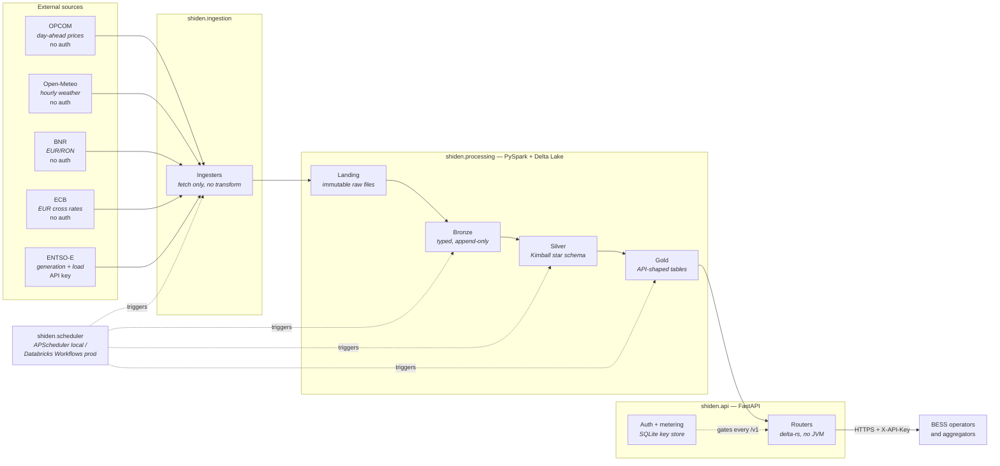
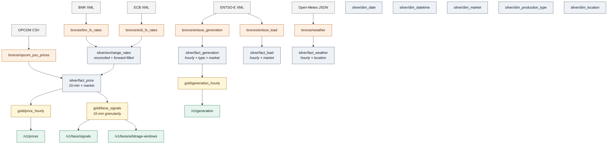
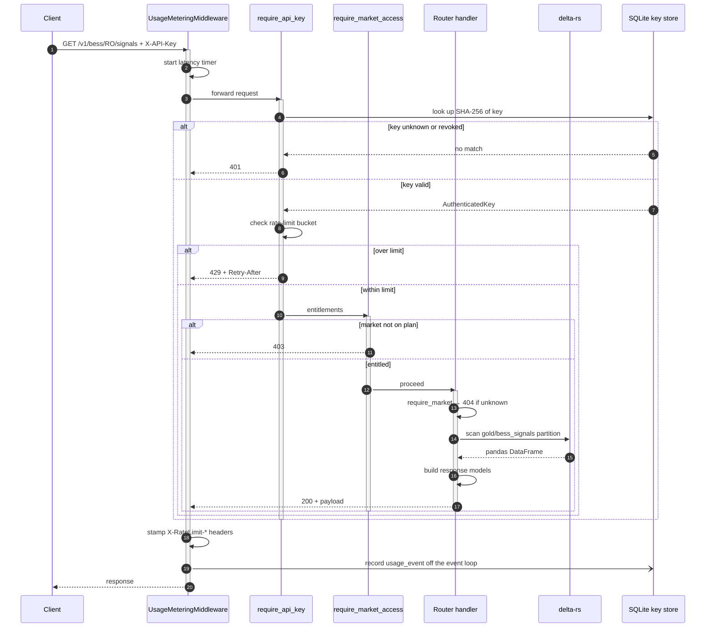
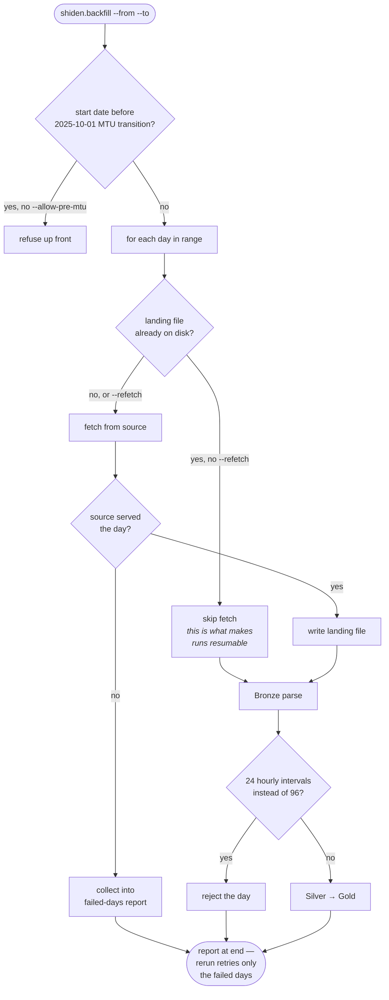
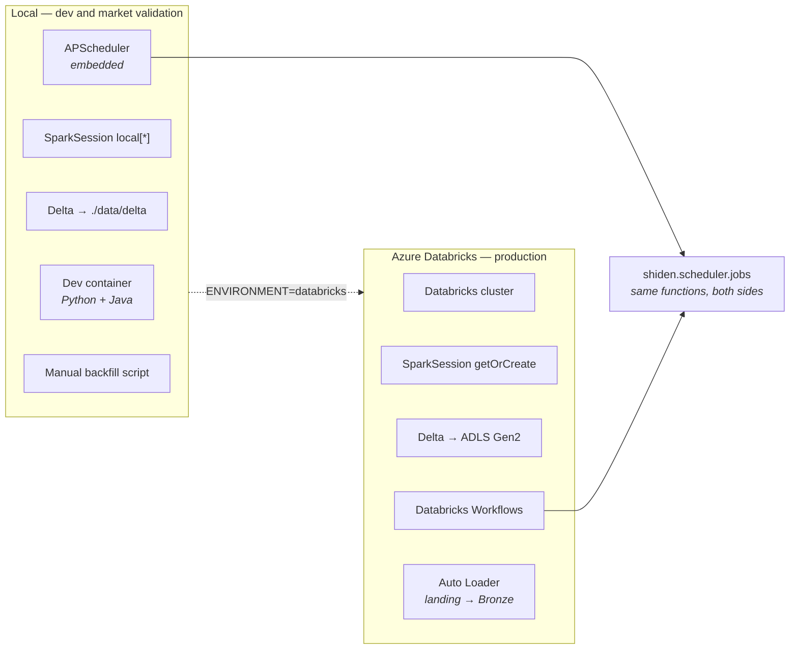

# System diagrams

Every diagram on this page is a Mermaid source block, rendered client-side by
Sphinx and also by GitHub when the Markdown is read in the repo browser. They
are generated from text, so they diff like code and cannot drift out of a
review unnoticed the way an exported image does.

Table and job names below are the real ones on disk — `gold/bess_signals`,
`silver/fact_price`, `run_silver_daily` — not illustrative placeholders.

## System context

Where the data comes from, what transforms it, and what serves it.

The API never opens a Spark session. It reads Gold through `delta-rs`, so a
request costs a Parquet scan rather than a JVM start-up — which is what makes
sub-second responses possible from a lakehouse.

## Data lineage

Every table that exists on disk, and what feeds it.

Two things this diagram is deliberately explicit about:

- **`gold/bess_signals` reads `silver/fact_price`, not `gold/price_hourly`.**
  Going back to the 15-minute Silver fact keeps the signals at the natural
  granularity of OPCOM day-ahead settlement. Deriving them from the hourly Gold
  table would throw away three quarters of the resolution the battery can
  actually trade on.
- **There is no `gold/arbitrage_windows` table.** Windows are contiguous runs
  of the same signal, computed per request in
  {py:func}`shiden.api.routers.bess.get_arbitrage_windows`. Materialising them
  would add a table that carries no information `gold/bess_signals` does not
  already have.

## Silver star schema

Conformed dimensions shared across fact tables, no snowflaking. Full column
reference: {doc}`silver_schema`.

```mermaid
erDiagram
    DIM_DATE ||--o{ FACT_PRICE : "date_id"
    DIM_DATE ||--o{ FACT_GENERATION : "date_id"
    DIM_DATE ||--o{ FACT_LOAD : "date_id"
    DIM_DATE ||--o{ FACT_WEATHER : "date_id"

    DIM_DATETIME ||--o{ FACT_PRICE : "timestamp_utc"
    DIM_DATETIME ||--o{ FACT_GENERATION : "hour_start_utc"
    DIM_DATETIME ||--o{ FACT_LOAD : "hour_start_utc"
    DIM_DATETIME ||--o{ FACT_WEATHER : "hour_start_utc"

    DIM_MARKET ||--o{ FACT_PRICE : "market_id"
    DIM_MARKET ||--o{ FACT_GENERATION : "market_id"
    DIM_MARKET ||--o{ FACT_LOAD : "market_id"

    DIM_PRODUCTION_TYPE ||--o{ FACT_GENERATION : "production_type_id"
    DIM_LOCATION ||--o{ FACT_WEATHER : "location_id"
    EXCHANGE_RATES ||--o{ FACT_PRICE : "date_id + currency"

    DIM_DATE {
        int date_id PK "YYYYMMDD"
        date full_date
        bool is_holiday
    }
    DIM_DATETIME {
        timestamp timestamp_utc PK "the only safe key"
        string timezone PK "IANA zone, not market"
        int interval_of_day "1-based, matches OPCOM"
        int local_time_id "0-95, NOT unique on fall-back"
        bool is_repeated_hour
    }
    DIM_MARKET {
        string market_id PK
        string bidding_zone "ENTSO-E EIC"
        string currency "settlement"
        int peak_start_hour "market convention"
    }
    DIM_PRODUCTION_TYPE {
        int production_type_id PK "stable, never renumbered"
        string entsoe_name
        bool is_renewable
    }
    DIM_LOCATION {
        int location_id PK
        float lat
        float lon
        float wind_weight
    }
    EXCHANGE_RATES {
        int date_id PK
        string currency_pair PK
        float rate
        string source "BNR|ECB|FORWARD_FILLED|SYNTHETIC"
    }
    FACT_PRICE {
        timestamp timestamp_utc PK
        string market_id PK
        float price_local_mwh
        float fx_rate "the rate actually applied"
        float price_eur_mwh
    }
    FACT_GENERATION {
        timestamp hour_start_utc PK
        string market_id PK
        int production_type_id PK
        float generation_mw
    }
    FACT_LOAD {
        timestamp hour_start_utc PK
        string market_id PK
        float load_mw
    }
    FACT_WEATHER {
        timestamp hour_start_utc PK
        int location_id PK
        float temperature_c
        float wind_speed_ms
    }
```

`dim_datetime` is keyed by **IANA timezone, not by market**. The interval axis
is a property of the zone, and European power markets routinely split one
country into several bidding zones — Italy has roughly seven, Sweden four,
Norway five, Denmark two — which would otherwise each store an identical axis.
Note this does *not* merge countries that happen to share DST rules: Greece is
`Europe/Athens` and Romania `Europe/Bucharest`, identical offsets today but
distinct tzdb entries. Collapsing them would mean keying on an offset
signature, which breaks silently the moment tzdb diverges.

## API request path

What actually happens between the client's `curl` and the bytes coming back.

The metering write is fire-and-forget through Starlette's threadpool. SQLite is
fast, but it is still blocking I/O, and telemetry must never add latency to the
signal the client actually came for. Rejected requests are recorded too — a
sustained run of `429`s or `403`s is the earliest evidence that a client has
outgrown its plan, and it is impossible to reconstruct after the fact.

## Daily pipeline schedule

All times Europe/Bucharest. Ordering is not arbitrary: each stage waits for the
sources it consumes to have landed.

```mermaid
gantt
    title Daily pipeline — Europe/Bucharest
    dateFormat HH:mm
    axisFormat %H:%M

    section Ingestion
    run_weather_daily      :w, 06:00, 30m
    run_entsoe_daily       :e, 08:00, 30m
    run_opcom_pzu_daily    :o, 14:00, 30m
    run_fx_rates_daily     :f, 17:00, 30m

    section Transform
    run_silver_daily       :s, 20:00, 45m
    run_gold_daily         :g, 21:00, 45m
```

Jobs are registered with `misfire_grace_time=3600` and `coalesce=True`: a run
missed by up to an hour executes late rather than being skipped, and a backlog
of missed runs collapses into a single execution instead of stampeding.

Each processor runs through `_run_safe`, which logs a failure as `ERROR` and
continues, so one broken source cannot abort the rest of the run. The OPCOM and
weather jobs refetch the last seven days on every run, so a transient upstream
outage repairs itself without operator action.

## Backfill decision path

The scheduler only ever fetches a window relative to *today*, so history goes
through {py:mod}`shiden.backfill`. This is the per-day logic that makes a run
resumable.

The pre-MTU check exists because the failure it prevents is silent, not loud.
OPCOM's pre-2025-10-01 exports contain 24 hourly intervals that are
*structurally identical* to the 96-interval quarter-hourly format. Ingesting
them would map each hour onto a single 15-minute slot and compress a day into
six hours — producing a table that loads cleanly, queries cleanly, and is
wrong. The Bronze parser therefore rejects such days regardless of flags;
`--allow-pre-mtu` only silences the up-front range check.

## Deployment topology

The same job functions run in both environments. That symmetry is the design
goal — there is no orchestration code to port.

`get_spark()` in {py:mod}`shiden.processing.spark` returns the appropriate
session for the `ENVIRONMENT` setting; nothing above it needs to know which one
it got.
