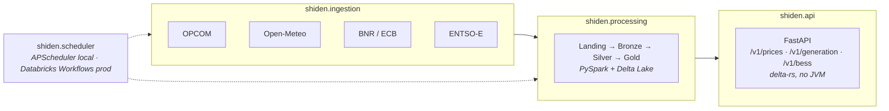

# Shiden

```{toctree}
:hidden:
:caption: Guides

getting-started
api-guide
operations
```

```{toctree}
:hidden:
:caption: Design

architecture
diagrams
time-model
silver_schema
```

```{toctree}
:hidden:
:caption: Reference

reference/index
reference/cli
```

```{toctree}
:hidden:
:caption: Appendix

appendix/index
```

Energy market data and **BESS** (Battery Energy Storage System) intelligence for
operators and aggregators. Shiden collects, processes and serves energy price
signals, weather data and derived intelligence — arbitrage windows,
charge/discharge signals, price forecasts.

**Initial market: Romania.** The architecture is multi-market from day one —
adding a market is config-only.

::::{grid} 1 1 2 2
:gutter: 3

:::{grid-item-card} {octicon}`rocket` Getting started
:link: getting-started
:link-type: doc

Install, configure, run the API and the scheduler, load history.
:::

:::{grid-item-card} {octicon}`plug` Using the API
:link: api-guide
:link-type: doc

Authentication, entitlements, rate limits, endpoints and error semantics.
:::

:::{grid-item-card} {octicon}`stack` Architecture
:link: architecture
:link-type: doc

The medallion pipeline, data sources, storage layout and deployment targets.
:::

:::{grid-item-card} {octicon}`git-branch` System diagrams
:link: diagrams
:link-type: doc

Context, lineage, star schema, request path, schedule and deployment.
:::

:::{grid-item-card} {octicon}`clock` Time model
:link: time-model
:link-type: doc

Why the UTC instant is the only safe key, and what DST does to a delivery day.
:::

:::{grid-item-card} {octicon}`tools` Operations
:link: operations
:link-type: doc

Scheduling, backfills, key management, testing and CI.
:::

:::{grid-item-card} {octicon}`code` Python API reference
:link: reference/index
:link-type: doc

Auto-generated reference for every module in `shiden`.
:::

::::

## How the pieces fit



Ingestion writes immutable raw files; the medallion processors refine them into
a Kimball star schema and then into API-shaped Gold tables. The API layer never
touches Spark — it reads Gold through `delta-rs`, so a request costs a Parquet
scan rather than a JVM start-up.

More detail, including full data lineage and the request path:
{doc}`diagrams`.

## Where to look for what

| Question | Page |
|---|---|
| How do I run this locally? | {doc}`getting-started` |
| What does a `403` mean and how do I get a key? | {doc}`api-guide` |
| Why is Bronze append-only? | {doc}`architecture` |
| What feeds `gold/bess_signals`? | {doc}`diagrams` |
| What happens on a DST changeover day? | {doc}`time-model` |
| Which columns are on `fact_price`? | {doc}`silver_schema` |
| How do I backfill 2025? | {doc}`operations` |
| What does `TimeAxis.intervals()` return? | {doc}`reference/index` |
