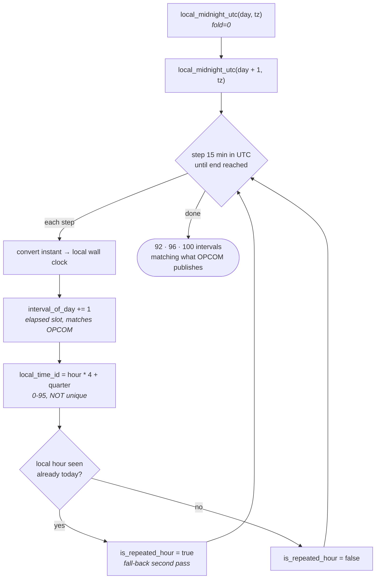

# Time model

This is the most subtle part of the system. Getting it wrong does not raise an
error — it silently produces plausible, wrong numbers on two days a year.

The rules live in {py:mod}`shiden.timeaxis` as pure stdlib code, with no Spark
dependency, so they are unit-tested in isolation and every processor derives its
time columns from the same implementation instead of reimplementing them.

## A delivery day is not 24 hours

A power delivery day is a **local** day. In a DST zone it has three possible
lengths:

| Day | Hours | 15-min intervals |
|---|---|---|
| Spring forward | 23 | 92 |
| Normal | 24 | 96 |
| Fall back | 25 | 100 |

For Romania in the current cycle: 2026-03-29 returns 92 intervals, 2025-10-26
returns 100.

## OPCOM numbers by elapsed slot, not clock position

OPCOM numbers intervals by *elapsed slot within the local day*. Its own summary
block proves it — the 08:00–20:00 peak window is published as intervals:

| Date | Peak intervals |
|---|---|
| Normal day | `33–80` |
| 2026-03-29 (spring forward) | `29–76` |
| 2025-10-26 (fall back) | `37–84` |

Deriving a clock time by treating the interval number as a fixed slot
(`time_id = interval - 1`) is therefore correct on 363 days a year and an hour
out on the other two, **in opposite directions**.

## How an interval list is built

{py:func}`~shiden.timeaxis.day_intervals` iterates in UTC and derives local
wall clock from it. That direction is what makes the 92 / 96 / 100 counts fall
out of the arithmetic instead of needing a special case per changeover.



Because iteration is bounded by two UTC instants rather than by a fixed count,
a 23-hour day simply runs out of steps sooner and a 25-hour day runs longer.
The counts are an *output*, never an assumption.

## The UTC instant is the only safe key

On the fall-back day, local 03:00 occurs twice. `(date_id, local_time_id)` is
genuinely non-unique, and any table keyed on it silently collapses two distinct
hours into one.

So:

- Facts key on `timestamp_utc` (prices) or `hour_start_utc` (hourly facts).
- Local columns — `local_timestamp`, `local_time_id`, `time_label` — are
  **labels only**. Never merge keys.
- {py:attr}`~shiden.timeaxis.Interval.is_repeated_hour` flags the second pass
  through a repeated local hour, so the ambiguity is explicit rather than
  inferred.

Iteration happens in UTC — stepping 15 minutes from one local midnight to the
next — and local wall clock is derived from it. That direction is what makes
the 92/96/100 counts fall out naturally instead of needing special cases.

```{eval-rst}
.. autofunction:: shiden.timeaxis.day_intervals
   :noindex:
```

## `dim_datetime` replaces the static `dim_time`

The old `dim_time` was a static 96-row table. That cannot represent a
changeover day at all — there is no 97th–100th row to join to.

{py:mod}`shiden.processing.silver.dimensions.dim_datetime` replaces it. Its
grain is **one row per settlement interval per IANA timezone**, generated over a
date range like `dim_date`. It resolves an OPCOM interval number to both an
instant and a clock label — neither of which is derivable arithmetically on a
changeover day.

### Keyed by timezone, not by market

The axis is a property of the *zone*, not the market. European power markets
routinely split one country into several bidding zones — Italy has about 7,
Sweden 4, Norway 5, Denmark 2 — which would otherwise each store an identical
axis.

This deliberately does **not** merge countries with matching rules. Greece is
`Europe/Athens`, Romania is `Europe/Bucharest`: identical offsets today,
distinct tzdb entries. Collapsing them would mean keying on an offset
signature, which breaks silently the moment tzdb diverges — for instance if the
EU abolishes seasonal clock changes and member states choose differently.

### Peak hours live on `dim_market`

Peak is a *market convention*, not a property of the time axis, so it comes
from {py:class}`~shiden.config.markets.MarketConfig` (`peak_start_hour`,
`peak_end_hour`, defaulting to OPCOM's 08:00–20:00) and `is_peak` is derived
where it is used. Two bidding zones sharing a timezone may define peak
differently; putting it on the shared axis would let a second market silently
inherit Romania's convention.

## Spark session timezone is pinned to UTC

`spark.sql.session.timeZone` is set to `UTC` in
{py:mod}`shiden.processing.spark`. Left unset, Spark defaults to the JVM's zone
and the same Delta table reads back differently on a laptop in Bucharest than
on a cluster in UTC — a class of bug that survives every test run on a
developer machine.

## Known gap

`dim_time` had only 96 rows, so on the autumn changeover day the four extra
intervals had no dimension row to join to. This is the defect `dim_datetime`
exists to fix; verify any table still joining to the old dimension has been
migrated (see {doc}`operations`).

## The pre-MTU trap

Before 2025-10-01, OPCOM exports carried 24 hourly intervals in a layout
structurally identical to the 96-interval quarter-hourly format. Nothing in the
file distinguishes them. Ingesting one would map each hour onto a single
15-minute slot and compress a day into six hours — with no error raised.

The Bronze parser therefore rejects hourly exports per-day, and
{py:mod}`shiden.backfill` refuses `--from` dates before the transition. This is
why the default backfill start date is 2025-10-01.
